# Manual de usuario
## Simulador interactivo del protocolo Go-Back-N

| | |
| --- | --- |
| **Producto** | Simulador Go-Back-N — protocolo de ventana deslizante con retroceso N |
| **Versión del documento** | 1.0 |
| **Fecha** | 15 de septiembre de 2026 |
| **Repositorio** | https://github.com/Juan1806y/Proyecto_GBN |
| **Documento relacionado** | `README.md` (guía técnica y de instalación) |

---

## Tabla de contenido

1. [Introducción](#1-introducción)
2. [Requisitos, instalación y ejecución](#2-requisitos-instalación-y-ejecución)
3. [Conceptos previos: el protocolo Go-Back-N](#3-conceptos-previos-el-protocolo-go-back-n)
4. [Descripción de la interfaz](#4-descripción-de-la-interfaz)
5. [Parámetros del simulador](#5-parámetros-del-simulador)
6. [La calculadora de rendimiento](#6-la-calculadora-de-rendimiento)
7. [Procedimientos](#7-procedimientos)
8. [Prácticas guiadas](#8-prácticas-guiadas)
9. [Atajos de teclado](#9-atajos-de-teclado)
10. [Resolución de problemas](#10-resolución-de-problemas)
11. [Glosario](#11-glosario)
12. [Bibliografía](#12-bibliografía)

---

# 1. Introducción

## 1.1 Propósito de este documento

Este manual explica cómo instalar, ejecutar y utilizar el **Simulador Go-Back-N**. Describe
todos los elementos de la interfaz, el significado exacto de cada parámetro y una serie de
procedimientos y prácticas guiadas para observar el comportamiento del protocolo.

La estructura sigue las recomendaciones de la norma **IEEE Std 1063** para documentación de
usuario de software: datos de identificación, introducción, información de uso, concepto de
operación, procedimientos, información sobre comandos, resolución de problemas y glosario.

## 1.2 Alcance del software

El simulador reproduce el protocolo de ventana deslizante con retroceso N (*Go-Back-N ARQ*)
de la capa de enlace de datos, tal como se describe en Tanenbaum & Wetherall §3.4. Permite:

- transmitir hasta 16 paquetes numerados del 0 al 15;
- observar la ventana de envío deslizándose sobre el búfer del emisor;
- ver las tramas y las confirmaciones viajando por el canal en tiempo real;
- provocar pérdidas de trama, pérdidas de ACK y retrasos;
- observar el disparo del temporizador y la retransmisión de la ventana completa;
- recorrer el protocolo evento a evento con la simulación en pausa;
- calcular la eficiencia teórica de un enlace real.

**Fuera de alcance.** El simulador modela el *retardo de propagación*; no modela el tiempo de
transmisión de la trama sobre el medio, la detección de errores mediante CRC, el control de
flujo por ventana variable ni la repetición selectiva. El tiempo de transmisión y la eficiencia
teórica se estudian en la calculadora (capítulo 6).

## 1.3 Destinatarios

Estudiantes y docentes de una asignatura de redes de computadores. Se supone conocido el
modelo de capas y la idea de trama; no se requiere saber programar para usar el simulador.

## 1.4 Convenciones del manual

| Convención | Significado |
| --- | --- |
| «Enviar nuevo paquete» | Texto que aparece literalmente en la pantalla |
| `npm run dev` | Orden que se teclea en una terminal |
| `N`, `t_p`, `T_out` | Símbolo de un parámetro |
| **Figura n** | Captura de pantalla de referencia |
| ⚠ | Advertencia: acción con consecuencias que conviene entender |

---

# 2. Requisitos, instalación y ejecución

## 2.1 Requisitos del sistema

| Elemento | Mínimo |
| --- | --- |
| Sistema operativo | Windows 10/11, macOS 12+ o Linux |
| Node.js | 20.19 o superior (recomendado 22 LTS) |
| Navegador | Chrome, Edge, Firefox o Safari en versión actual |
| Resolución de pantalla | 1280 × 800 (recomendado 1600 × 1000 o superior) |
| Espacio en disco | ≈ 300 MB con las dependencias instaladas |

## 2.2 Instalación

```bash
git clone https://github.com/Juan1806y/Proyecto_GBN.git
cd Proyecto_GBN
npm install
```

## 2.3 Ejecución

```bash
npm run dev
```

La terminal mostrará una dirección, normalmente `http://localhost:5173`. Ábrela en el
navegador. La aplicación se recarga sola al guardar cambios en el código.

Para detener el servidor, pulsa `Ctrl + C` en la terminal.

## 2.4 Comprobación de la instalación

El proyecto incluye un banco de pruebas del protocolo que se ejecuta sin navegador:

```bash
npm run verify
```

Debe terminar con `TODAS LAS PRUEBAS PASAN` (50 comprobaciones). Si alguna falla, el
simulador no está reproduciendo correctamente el protocolo y no conviene usarlo para clase.

## 2.5 Versión de producción

```bash
npm run build
```

Genera la carpeta `dist/` con la aplicación lista para publicar en cualquier servidor web
estático. Para verla en local: `npm run preview`.

---

# 3. Conceptos previos: el protocolo Go-Back-N

Este capítulo resume lo mínimo para interpretar lo que muestra la pantalla. La aplicación
incluye el mismo contenido, ampliado, en el panel «Teoría y fórmulas».

## 3.1 El problema: por qué no basta con parada y espera

En el protocolo más simple, *parada y espera*, el emisor manda una trama y no envía la
siguiente hasta recibir su confirmación. Mientras espera, el canal está vacío. En un enlace
con retardo grande —un satélite, por ejemplo— el emisor pasa la mayor parte del tiempo sin
hacer nada: la eficiencia cae por debajo del 4 % (capítulo 6.5).

La solución es el **encauzamiento** (*pipelining*): permitir varias tramas en vuelo
simultáneamente.

## 3.2 La ventana deslizante

El emisor mantiene una **ventana de envío** de **apertura N**: el número máximo de tramas que
puede tener enviadas y todavía sin confirmar. La ventana se apoya en dos punteros:

- **`base`** — la primera trama enviada y aún sin confirmar. Marca el extremo izquierdo de la
  ventana y es la única que lleva temporizador.
- **`nextSeqNum`** — el número que se asignará a la próxima trama nueva.

Solo puede enviarse una trama nueva mientras se cumpla `nextSeqNum < base + N`. Cuando deja
de cumplirse, la ventana está llena y el emisor debe esperar.

## 3.3 Reglas del emisor

```
enviar(datos):
    si nextSeqNum < base + N:
        transmitir(trama[nextSeqNum])
        si base == nextSeqNum: arrancar_temporizador()
        nextSeqNum = nextSeqNum + 1
    si no:
        rechazar                      // ventana llena

al recibir ACK n:                     // confirmación ACUMULATIVA
    base = n + 1
    si base == nextSeqNum: detener_temporizador()
    si no:                 arrancar_temporizador()

al expirar el temporizador:
    arrancar_temporizador()
    retransmitir todas las tramas de base .. nextSeqNum − 1
```

## 3.4 Reglas del receptor

```
al recibir trama con número de secuencia seq:
    si seq == expectedSeqNum:
        entregar_a_capa_de_red(trama)
        enviar(ACK expectedSeqNum)
        expectedSeqNum = expectedSeqNum + 1
    si no:
        descartar(trama)                     // fuera de orden
        enviar(ACK expectedSeqNum − 1)       // último ACK válido
```

La ventana de recepción tiene **apertura 1**: el receptor no guarda tramas fuera de orden. Esa
es la simplificación que define a Go-Back-N y, al mismo tiempo, su coste.

## 3.5 Confirmaciones acumulativas

`ACK n` confirma **todas** las tramas hasta la `n` inclusive, no solo la `n`. La consecuencia
práctica es importante: si se pierde el `ACK 1` pero llega el `ACK 2`, la ventana se desliza
igualmente y el emisor nunca llega a enterarse de la pérdida.

## 3.6 El temporizador y el retroceso N

Existe **un solo temporizador**, asociado a la trama `base`. Si expira, el emisor supone que
esa trama se perdió y retransmite **toda la ventana**, no solo la trama base: de ahí el nombre
«retroceso N». Es un desperdicio deliberado, a cambio de que el receptor no necesite búfer.

## 3.7 Números de secuencia

Con un campo de secuencia de `m` bits, la apertura de la ventana debe cumplir:

```
N ≤ 2^m − 1
```

No puede usarse `2^m` porque el receptor no podría distinguir una retransmisión de una trama
nueva. Con `m = 3` bits, el máximo es `N = 7`. El simulador numera del 0 al 15 para facilitar
el seguimiento visual, y muestra en cada momento cuántos bits exigiría la `N` elegida.

---

# 4. Descripción de la interfaz

## 4.1 Vista general

La pantalla se organiza en una columna de control a la izquierda y una columna de simulación
a la derecha, ordenada de arriba abajo según el recorrido de una trama: **emisor → canal →
receptor**.

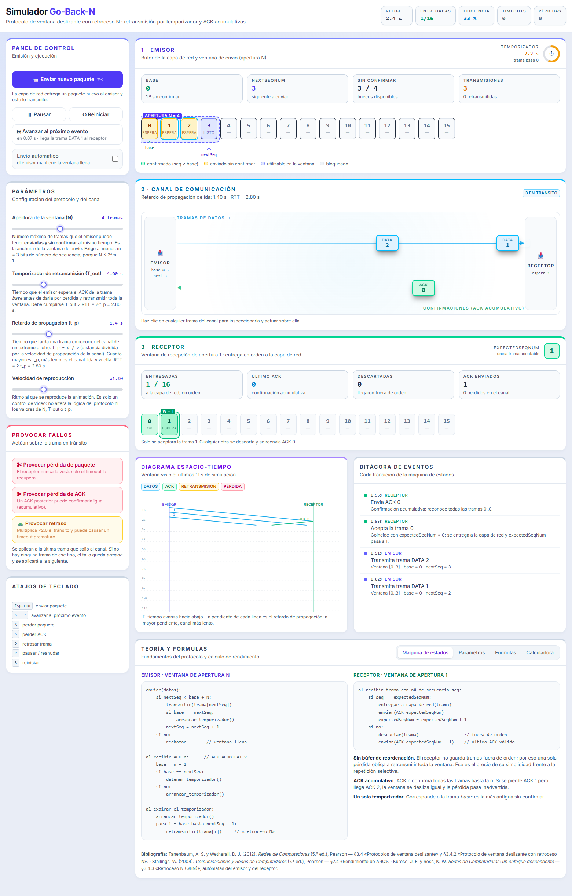
**Figura 1.** Vista general con tres tramas en vuelo.

## 4.2 Barra de estado

La cabecera muestra cinco indicadores globales, siempre visibles:

| Indicador | Significado |
| --- | --- |
| **RELOJ** | Tiempo de simulación transcurrido, en segundos |
| **ENTREGADAS** | Tramas entregadas en orden a la capa de red del receptor, sobre el total de 16 |
| **EFICIENCIA** | Tramas entregadas ÷ transmisiones realizadas (retransmisiones incluidas) |
| **TIMEOUTS** | Veces que ha expirado el temporizador |
| **PÉRDIDAS** | Tramas y ACK destruidos en el canal |

A la derecha aparecen además etiquetas de estado: «⏸ en pausa» y «✓ transferencia completa».

## 4.3 Panel de control


**Figura 2.** Panel de control.

| Elemento | Función |
| --- | --- |
| **📨 Enviar nuevo paquete** | La capa de red entrega un paquete al emisor y este lo transmite. El número que aparece a la derecha es el `nextSeqNum` que se usará. Se **deshabilita** cuando la ventana está llena o no quedan paquetes; el texto inferior explica siempre el motivo |
| **⏸ Pausar / ▶ Reanudar** | Detiene o reanuda el reloj de simulación |
| **↺ Reiniciar** | Vuelve al estado inicial conservando los parámetros |
| **⏭ Avanzar al próximo evento** | Adelanta el reloj justo hasta el siguiente suceso del protocolo. Bajo el botón se anuncia **cuál será y cuánto falta**. Funciona también en pausa |
| **Envío automático** | El emisor manda tramas por su cuenta mientras quede hueco en la ventana |

## 4.4 Panel de parámetros

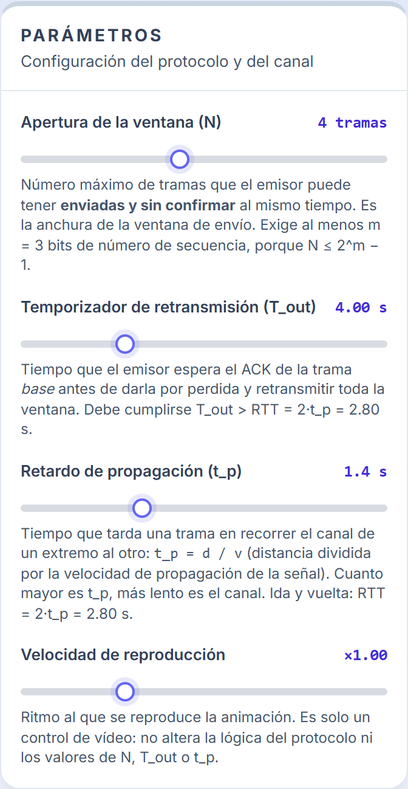
**Figura 3.** Parámetros del protocolo y del canal. Cada slider explica bajo su nombre qué
representa y con qué fórmula se relaciona.

Los cuatro parámetros se describen en detalle en el [capítulo 5](#5-parámetros-del-simulador).

## 4.5 Panel de fallos provocados

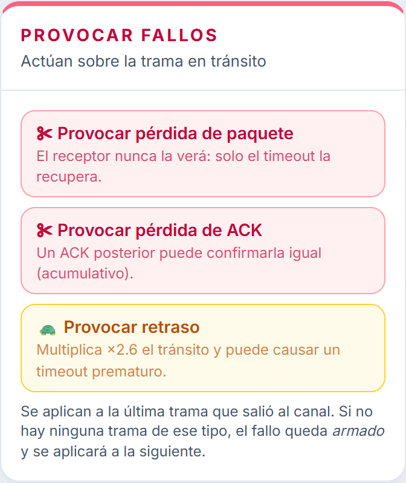
**Figura 4.** Inyección de errores.

| Botón | Efecto |
| --- | --- |
| **✂ Provocar pérdida de paquete** | Destruye en el canal una trama de datos: el receptor nunca la verá y solo el temporizador podrá recuperarla |
| **✂ Provocar pérdida de ACK** | Destruye una confirmación. Como los ACK son acumulativos, un ACK posterior puede confirmar la trama igualmente |
| **🐢 Provocar retraso** | Multiplica por 2,6 el trayecto que le queda a la trama. Si el retraso supera al temporizador se produce un **timeout prematuro** |

**A qué trama se aplican.** Si hay una trama seleccionada (capítulo 4.7), el fallo va sobre
ella. Si no, sobre la última que salió al canal. Y si en ese momento no viaja ninguna trama
del tipo indicado, el fallo queda **armado**: una etiqueta lo anuncia en la cabecera del canal
y se aplicará a la siguiente trama que salga.

⚠ Con la simulación **en pausa**, la pérdida se aplica en el acto, sobre el punto exacto del
canal donde se ve la trama.

## 4.6 Panel 1 · Emisor

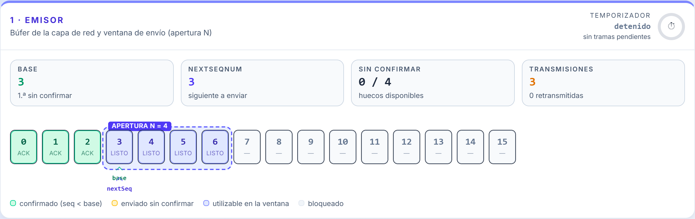
**Figura 5.** Panel del emisor con la ventana desplazada tras recibir confirmaciones.

**Indicadores numéricos**

| Campo | Significado |
| --- | --- |
| **BASE** | Primera trama sin confirmar |
| **NEXTSEQNUM** | Siguiente número de secuencia libre |
| **SIN CONFIRMAR** | Tramas en vuelo o pendientes de ACK, sobre la apertura `N` |
| **TRANSMISIONES** | Transmisiones totales, con el número de retransmisiones debajo |
| **TEMPORIZADOR** | Tiempo restante y anillo de progreso. Se pone en rojo en el último 25 % |

**Búfer de paquetes.** La fila de 16 casillas es el búfer de la capa de red. El recuadro
punteado es la ventana de envío, rotulado «APERTURA N = n», y se desliza con una animación
cada vez que llega un ACK. Bajo la fila, dos punteros señalan `base` y `nextSeq`.

**Código de color de las casillas**

| Color | Estado | Condición |
| --- | --- | --- |
| Verde | Confirmado | `seq < base` |
| Ámbar | Enviado, sin confirmar | `base ≤ seq < nextSeqNum` |
| Índigo | Utilizable | `nextSeqNum ≤ seq < base + N` |
| Gris | Bloqueado | fuera de la ventana |

Una casilla con anillo azul indica que esa trama está viajando ahora mismo por el canal, y la
etiqueta `retx` que se trata de una retransmisión.

## 4.7 Panel 2 · Canal de comunicación

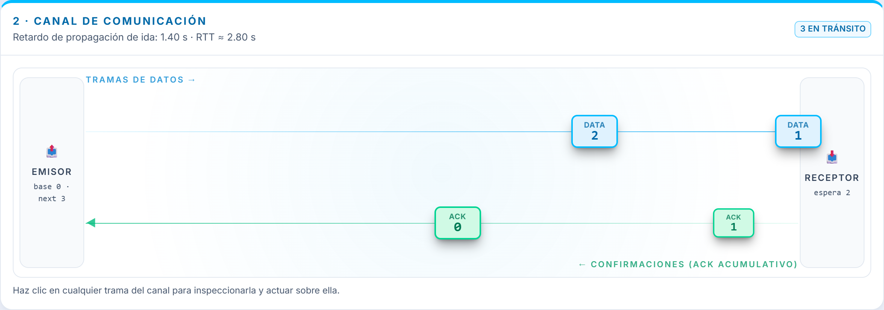
**Figura 6.** Canal con tramas de datos en vuelo.

El canal tiene dos carriles: las **tramas de datos** viajan por el superior de izquierda a
derecha y las **confirmaciones** por el inferior de derecha a izquierda. La cabecera indica el
retardo de propagación configurado y el RTT resultante.

El tiempo que una trama tarda en cruzar la pantalla **es exactamente** el retardo de
propagación `t_p`: la animación no es decorativa, está gobernada por el reloj de simulación.

**Distintivos de las tramas**

| Aspecto | Significado |
| --- | --- |
| Azul | Trama de datos |
| Verde | Confirmación (ACK) |
| Ámbar con ↻ | Retransmisión |
| 🐢 | Trama retrasada artificialmente |
| Rojo con ✕ | Trama destruida en el canal |

**Selección e inspección.** Al pulsar una trama se abre su ficha bajo el canal y aparece sobre
ella una barra con las acciones «✂ perder» y «🐢 retrasar».


**Figura 7.** Simulación en pausa con una trama seleccionada.

La ficha muestra el porcentaje de recorrido, el tiempo que le falta, el instante en que salió
y el instante en que llegará, y una **previsión** del desenlace: si el receptor la aceptará o
la descartará y con qué ACK responderá. La previsión supone que nada más cambia; un timeout
intermedio puede alterarla.

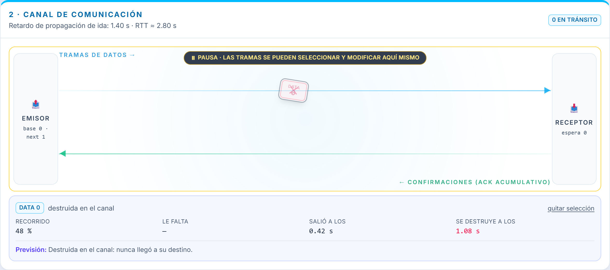
**Figura 8.** La misma trama tras provocar su pérdida durante la pausa: el efecto es
inmediato, sin necesidad de reanudar.

## 4.8 Panel 3 · Receptor

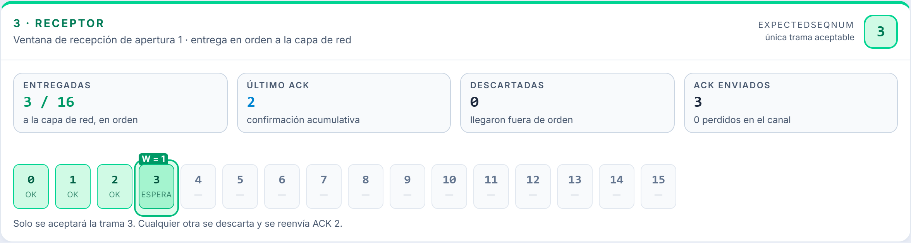
**Figura 9.** Panel del receptor.

| Campo | Significado |
| --- | --- |
| **expectedSeqNum** | Única trama que el receptor aceptará, destacada arriba a la derecha |
| **ENTREGADAS** | Tramas entregadas en orden a la capa de red |
| **ÚLTIMO ACK** | Última confirmación emitida |
| **DESCARTADAS** | Tramas rechazadas por llegar fuera de orden |
| **ACK ENVIADOS** | Confirmaciones emitidas, con las perdidas debajo |

El recuadro verde rotulado «W = 1» sobre la fila de casillas recuerda que la ventana de
recepción tiene apertura 1. Debajo, una frase indica en todo momento qué trama se aceptará y
qué ACK se reenviará si llega otra.

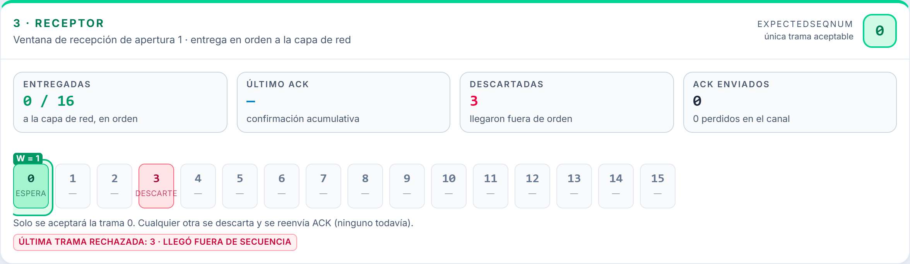
**Figura 10.** El receptor tras perderse la trama 0: sigue esperando la 0 y ha descartado tres
tramas que llegaron fuera de orden.

## 4.9 Diagrama espacio-tiempo

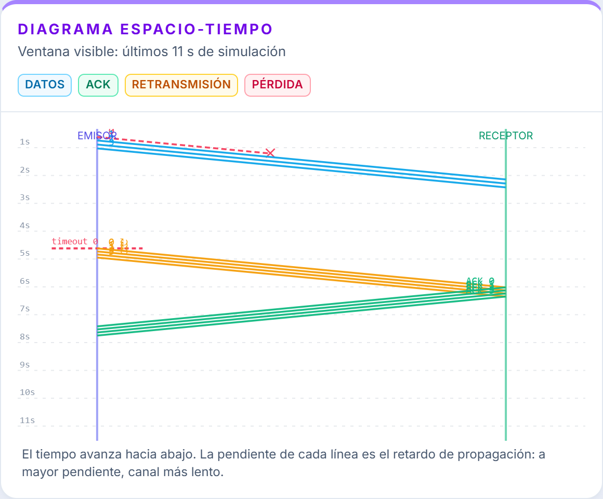
**Figura 11.** Diagrama espacio-tiempo de un episodio completo de retroceso N.

Es la representación clásica de los libros de texto: el tiempo avanza **hacia abajo**, el eje
izquierdo es el emisor y el derecho el receptor, y cada trama es una línea diagonal cuya
pendiente es el retardo de propagación.

- Líneas azules: tramas de datos.
- Líneas verdes: confirmaciones.
- Líneas ámbar: retransmisiones.
- Línea roja discontinua terminada en ✕: trama destruida a mitad de camino.
- Marca roja «timeout n» sobre el eje del emisor: expiración del temporizador.

La ventana visible se ajusta sola al retardo configurado y se desplaza a medida que avanza la
simulación. Varias líneas casi superpuestas indican salidas casi simultáneas, típicas de una
ráfaga de retransmisión.

## 4.10 Bitácora de eventos

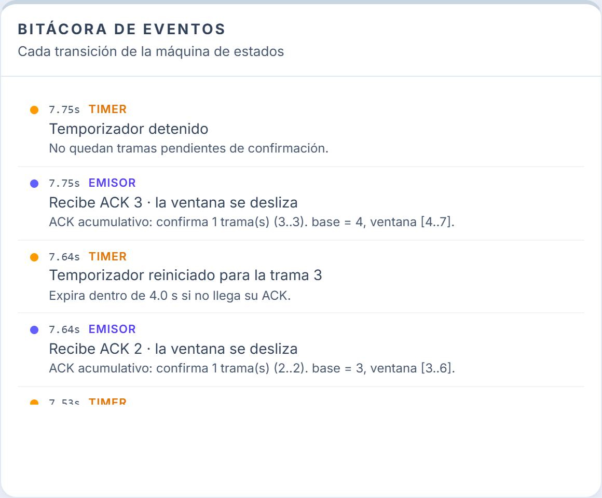
**Figura 12.** Bitácora de eventos.

Registra en orden cronológico inverso **cada transición de la máquina de estados**, con su
marca de tiempo y una explicación. El color del punto indica el origen: emisor (índigo),
receptor (verde), canal (rojo), temporizador (ámbar) y sistema (gris).

## 4.11 Panel de teoría y fórmulas

Cuatro pestañas:

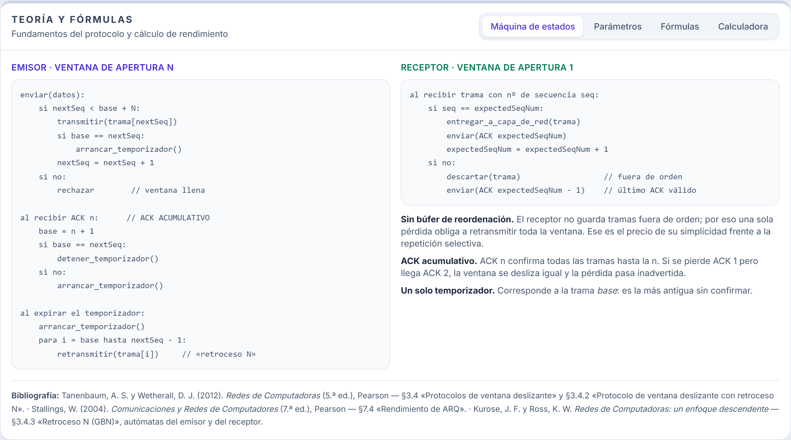
**Figura 13.** Pestaña «Máquina de estados»: el pseudocódigo del emisor y del receptor.

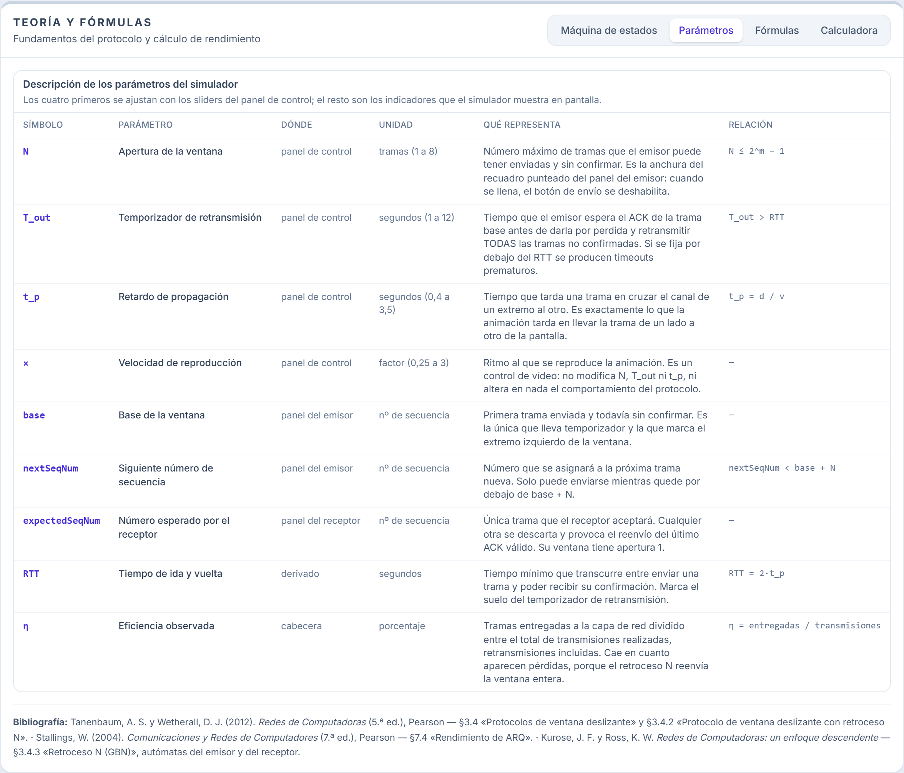
**Figura 14.** Pestaña «Parámetros»: definición de cada control e indicador del simulador.

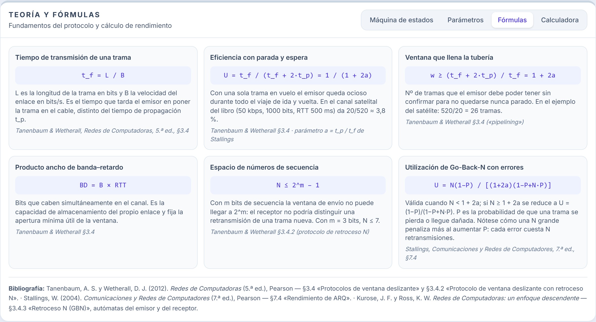
**Figura 15.** Pestaña «Fórmulas»: las seis expresiones de rendimiento, cada una con su fuente
bibliográfica.

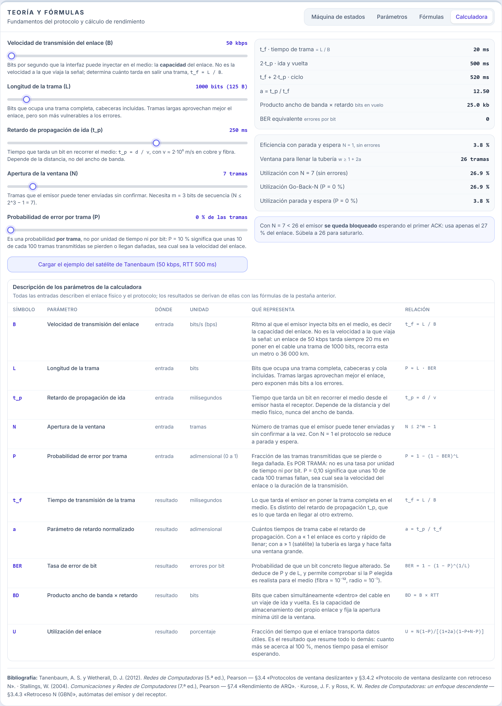
**Figura 16.** Pestaña «Calculadora» (capítulo 6).

---

# 5. Parámetros del simulador

Los cuatro sliders del panel «Parámetros» se pueden mover **en cualquier momento**, incluso
con tramas en vuelo. El cambio afecta a lo que ocurra a partir de ese instante.

| Símbolo | Parámetro | Unidad y rango | Valor inicial | Qué representa |
| --- | --- | --- | --- | --- |
| `N` | **Apertura de la ventana** | tramas, 1 – 8 | 4 | Número máximo de tramas que el emisor puede tener enviadas y sin confirmar a la vez. Es la anchura del recuadro punteado del panel del emisor. Cuando se llena, el botón de envío se deshabilita |
| `T_out` | **Temporizador de retransmisión** | segundos, 1 – 12 | 4,00 | Tiempo que el emisor espera el ACK de la trama `base` antes de darla por perdida y retransmitir toda la ventana |
| `t_p` | **Retardo de propagación** | segundos, 0,4 – 3,5 | 1,4 | Tiempo que tarda una trama en cruzar el canal de un extremo al otro. Es exactamente lo que la animación tarda en llevarla de un lado a otro de la pantalla |
| — | **Velocidad de reproducción** | factor, 0,25 – 3 | ×1,00 | Ritmo al que se reproduce la animación. Es un control de vídeo: **no** modifica `N`, `T_out` ni `t_p`, ni altera el comportamiento del protocolo |

## 5.1 Relaciones entre parámetros

```
RTT   = 2 · t_p                 tiempo mínimo entre enviar una trama y recibir su ACK
t_p   = d / v                   d = distancia, v ≈ 2·10⁸ m/s en cobre y fibra
T_out > RTT                     si no, habrá timeouts prematuros
N     ≤ 2^m − 1                 m = bits del campo de número de secuencia
```

⚠ **Sobre la velocidad de propagación.** En versiones anteriores este control se llamaba
«velocidad de propagación», lo que inducía a error: el valor que se ajusta es un **retardo**,
de modo que subirlo hace el canal *más lento*. La velocidad de propagación propiamente dicha
es `v`, la velocidad de la señal en el medio, que interviene en `t_p = d / v`.

## 5.2 Indicadores en pantalla

| Símbolo | Dónde | Qué representa |
| --- | --- | --- |
| `base` | Emisor | Primera trama enviada y sin confirmar; la única con temporizador |
| `nextSeqNum` | Emisor | Siguiente número de secuencia libre |
| `expectedSeqNum` | Receptor | Única trama que el receptor aceptará |
| `RTT` | Cabecera del canal | `2 · t_p` |
| `η` | Cabecera | Eficiencia observada = entregadas ÷ transmisiones |

---

# 6. La calculadora de rendimiento

## 6.1 Para qué sirve

El simulador enseña **cómo se comporta** el protocolo; la calculadora responde a **cuánto
rinde** sobre un enlace real. Permite introducir las características físicas de un enlace y
obtener la eficiencia teórica, la apertura de ventana necesaria para saturarlo y el efecto de
los errores.

Está en el panel «Teoría y fórmulas», pestaña «Calculadora» (Figura 16).

## 6.2 Parámetros de entrada

| Símbolo | Parámetro | Unidad y rango | Definición |
| --- | --- | --- | --- |
| `B` | **Velocidad de transmisión del enlace** | bits/s, 10 kbps – 10 Mbps | Ritmo al que el emisor inyecta bits en el medio, es decir la **capacidad** del enlace |
| `L` | **Longitud de la trama** | bits, 200 – 12 000 | Bits que ocupa una trama completa, cabeceras y cola incluidas |
| `t_p` | **Retardo de propagación de ida** | ms, 1 – 400 | Tiempo que tarda un bit en recorrer el medio |
| `N` | **Apertura de la ventana** | tramas, 1 – 64 | Tramas que el emisor puede tener enviadas sin confirmar |
| `P` | **Probabilidad de error por trama** | adimensional, 0 – 0,5 | Fracción de las tramas transmitidas que se pierde o llega dañada |

### 6.2.1 Qué es exactamente la velocidad de transmisión del enlace

`B` es la **capacidad** del enlace: cuántos bits por segundo puede poner el emisor en el medio.
Determina el **tiempo de transmisión** de una trama:

```
        L (bits)
t_f = ────────────
        B (bits/s)
```

Es fácil confundirla con la velocidad de propagación, pero son magnitudes distintas:

| | Velocidad de transmisión `B` | Velocidad de propagación `v` |
| --- | --- | --- |
| Qué mide | Bits por segundo que el emisor introduce en el medio | Metros por segundo a los que avanza la señal |
| De qué depende | Del equipo y de la codificación | Del medio físico (≈ 2·10⁸ m/s en cobre y fibra) |
| Unidad | bits/s | m/s |
| En qué se traduce | `t_f = L / B` (tiempo de transmisión) | `t_p = d / v` (retardo de propagación) |

Un enlace de 50 kbps tarda siempre 20 ms en poner en el cable una trama de 1000 bits,
**recorra esta un metro o 36 000 km**. Lo que cambia con la distancia es `t_p`, no `t_f`.

### 6.2.2 ¿La tasa de error es por unidad de tiempo o por trama?

**Es por trama.** `P` es la probabilidad de que **una trama concreta** se pierda o llegue
dañada; no es una tasa por segundo ni por bit. Así, `P = 0,10` significa que aproximadamente
10 de cada 100 tramas transmitidas fallan, **sea cual sea** la velocidad del enlace o la
duración de la transmisión.

Esta elección es la que exige la fórmula de utilización de Stallings (§7.4), donde `P`
representa la fracción de tramas que hay que retransmitir.

Si se conoce en cambio la **tasa de error de bit** (BER), que sí es una probabilidad por bit,
ambas magnitudes se relacionan suponiendo errores de bit independientes: una trama sobrevive
solo si sobreviven sus `L` bits.

```
P = 1 − (1 − BER)^L          y, despejando,      BER = 1 − (1 − P)^(1/L)

para BER pequeña:   P ≈ L · BER
```

La calculadora muestra el resultado **«BER equivalente»** precisamente para poder comprobar si
la `P` elegida es realista. Como referencia: la fibra óptica trabaja con BER del orden de
10⁻¹², un enlace de cobre en torno a 10⁻⁹ y un radioenlace en torno a 10⁻⁵.

> **Ejemplo.** Con `L = 1000` bits y `P = 10 %`, la BER equivalente es 1,05 × 10⁻⁴, un valor
> propio de un enlace inalámbrico ruidoso. Pedirle a una fibra óptica una `P` del 10 % no
> tiene sentido físico.

## 6.3 Resultados

| Símbolo | Resultado | Fórmula | Qué indica |
| --- | --- | --- | --- |
| `t_f` | Tiempo de transmisión de la trama | `t_f = L / B` | Lo que tarda el emisor en poner la trama en el medio |
| `2·t_p` | Tiempo de ida y vuelta | — | Retardo que el emisor debe esperar antes de recibir el ACK |
| `t_f + 2·t_p` | Ciclo de parada y espera | — | Tiempo total por trama si no hubiera encauzamiento |
| `a` | Retardo normalizado | `a = t_p / t_f` | Cuántos tiempos de trama cabe el retardo. Con `a » 1` la tubería es larga |
| `BD` | Producto ancho de banda × retardo | `BD = B × RTT` | Bits que caben simultáneamente dentro del enlace |
| `BER` | Tasa de error de bit | `BER = 1 − (1 − P)^(1/L)` | Probabilidad de error por bit equivalente a `P` |
| — | Eficiencia con parada y espera | `U = 1 / (1 + 2a)` | Rendimiento con `N = 1` y sin errores |
| `w` | Ventana para llenar la tubería | `w ≥ 1 + 2a` | Apertura mínima que evita que el emisor se quede parado |
| `U` | Utilización con la `N` elegida | `U = min(1, N / (1+2a))` | Rendimiento sin errores |
| `U` | Utilización Go-Back-N con errores | `U = N(1−P) / [(1+2a)(1−P+N·P)]` | Rendimiento real; si `N ≥ 1+2a`, se reduce a `U = (1−P)/(1−P+N·P)` |

Bajo los resultados, un recuadro interpreta la situación en lenguaje llano: indica si la
ventana llena la tubería o si el emisor se queda bloqueado, y qué apertura haría falta.

## 6.4 Ejemplo resuelto: el canal satelital de Tanenbaum

El botón **«Cargar el ejemplo del satélite de Tanenbaum»** reproduce el caso clásico del libro
(§3.4): un canal de 50 kbps con 500 ms de retardo de ida y vuelta y tramas de 1000 bits.

| Magnitud | Valor |
| --- | --- |
| `t_f = 1000 / 50 000` | 20 ms |
| `2·t_p` | 500 ms |
| Ciclo `t_f + 2·t_p` | 520 ms |
| `a = 250 / 20` | 12,5 |
| Eficiencia con parada y espera `20/520` | **3,8 %** |
| Ventana necesaria `520/20` | **26 tramas** |

Es decir: con parada y espera se desperdicia el 96 % de la capacidad del enlace, y hacen falta
26 tramas en vuelo para aprovecharlo por completo. Sube el slider `N` hasta 26 y observa cómo
la utilización llega al 100 %.

---

# 7. Procedimientos

## 7.1 Transmitir la primera trama

1. Pulsa **«📨 Enviar nuevo paquete»** (o la barra espaciadora).
2. La casilla 0 del emisor pasa a ámbar y aparece una trama azul en el canal.
3. El temporizador arranca: es la trama `base`.
4. Tras `t_p` segundos la trama llega al receptor, que la acepta y devuelve `ACK 0`.
5. Al llegar el ACK, `base` pasa a 1, la ventana se desliza y el temporizador se detiene.

## 7.2 Llenar la ventana

1. Pulsa «Enviar nuevo paquete» cuatro veces seguidas (con `N = 4`).
2. Al cuarto envío el botón se deshabilita y aparece el mensaje «Ventana llena: 4 trama(s) sin
   confirmar con N = 4. El emisor debe esperar un ACK.»
3. Cuando llegue el primer ACK se liberará un hueco y el botón volverá a habilitarse.

## 7.3 Provocar la pérdida de una trama de datos

**Con la simulación en marcha**

1. Envía una trama y pulsa **«✂ Provocar pérdida de paquete»** mientras viaja.
2. La trama se vuelve roja, aparece una ✕ y desaparece del canal.
3. El receptor nunca la recibe: solo el temporizador la recuperará.

**Con la simulación en pausa** *(recomendado para clase)*

1. Envía una trama y pulsa **«⏸ Pausar»** cuando esté a media pantalla.
2. Pulsa sobre la trama para seleccionarla.
3. Pulsa **«✂ perder»** en la barra que aparece sobre ella, o «✂ Perder esta trama» en la ficha.
4. La destrucción se ve **en el acto**, en el punto exacto del canal, y queda anotada en la
   bitácora con la marca de tiempo actual.

## 7.4 Provocar la pérdida de un ACK

1. Envía dos tramas separadas por medio segundo.
2. Espera a que el primer ACK aparezca en el carril inferior.
3. Selecciónalo y pulsa **«✂ perder»**.
4. Observa que, pese a la pérdida, cuando llegue el `ACK 1` la ventana se desliza dos
   posiciones: es la propiedad acumulativa.

## 7.5 Trabajar con la simulación en pausa

La pausa no es una simple congelación: el canal se vuelve manipulable.

1. Pulsa **«⏸ Pausar»** (o la tecla `P`).
2. Aparece un rótulo en el canal: «PAUSA · LAS TRAMAS SE PUEDEN SELECCIONAR Y MODIFICAR AQUÍ
   MISMO».
3. Pulsa cualquier trama para abrir su ficha (Figura 7).
4. Los fallos que provoques se aplican inmediatamente.
5. Puedes enviar tramas nuevas estando en pausa: aparecerán en el borde del emisor.

## 7.6 Recorrer el protocolo paso a paso

1. Pon la simulación en pausa.
2. Lee bajo el botón **«⏭ Avanzar al próximo evento»** qué va a ocurrir y cuándo, por ejemplo
   «en 0,71 s · llega la trama DATA 0 al receptor».
3. Pulsa el botón (o la tecla `S`, o la flecha `→`).
4. El reloj salta exactamente hasta ese instante, el evento se ejecuta y la simulación
   **sigue en pausa**.
5. Repite. Cada pulsación avanza un único suceso del protocolo.

Este es el modo recomendado para explicar el protocolo en clase: pausar → seleccionar una
trama → provocar el fallo → avanzar evento a evento para ver la consecuencia.

## 7.7 Calcular la apertura de ventana óptima de un enlace

1. Abre «Teoría y fórmulas» → pestaña **«Calculadora»**.
2. Ajusta `B`, `L` y `t_p` con los datos del enlace.
3. Lee el resultado **«Ventana para llenar la tubería»**: es la apertura mínima `w ≥ 1 + 2a`.
4. Sube el slider `N` hasta ese valor y comprueba que la utilización alcanza el 100 %.
5. Si el enlace tiene errores, sube `P` y observa cuánto cae la utilización: con Go-Back-N,
   cada error cuesta `N` retransmisiones, de modo que una ventana grande **penaliza** cuando
   `P` crece.

---

# 8. Prácticas guiadas

## Práctica 1 — La ventana limita al emisor

**Objetivo.** Comprobar que la apertura de la ventana acota el número de tramas en vuelo.

1. Reinicia (`R`). Deja `N = 4`.
2. Pulsa «Enviar nuevo paquete» cinco veces seguidas.

**Observa.** El quinto envío se rechaza. En el panel del emisor, «SIN CONFIRMAR» marca 4/4 y
aparece la etiqueta «LA VENTANA ESTÁ LLENA».

**Preguntas.** ¿Cuántas tramas caben en el canal con `t_p = 1,4 s`? ¿Qué `N` haría falta para
que el emisor no se detuviera nunca?

## Práctica 2 — El ACK acumulativo perdona pérdidas

**Objetivo.** Ver que la pérdida de un ACK puede no tener ninguna consecuencia.

1. Reinicia. Envía la trama 0 y, medio segundo después, la trama 1.
2. Cuando aparezca el `ACK 0` en el carril inferior, selecciónalo y piérdelo.

**Observa.** No hay timeout ni retransmisión: al llegar el `ACK 1`, `base` salta de 0 a 2. La
bitácora lo explica: «ACK acumulativo: confirma 2 trama(s)».

**Preguntas.** ¿Qué habría pasado si el protocolo usara confirmaciones individuales?

## Práctica 3 — El coste del retroceso N

**Objetivo.** Medir el desperdicio que provoca una sola pérdida.

1. Reinicia. Pulsa `X` para armar la pérdida de la próxima trama.
2. Envía cuatro tramas seguidas.
3. Espera a que expire el temporizador.

**Observa.** La trama 0 se pierde; las tramas 1, 2 y 3 llegan pero el receptor las **descarta**
por estar fuera de orden y ni siquiera envía ACK (aún no tiene ninguno válido). Al expirar el
temporizador se retransmiten las cuatro.

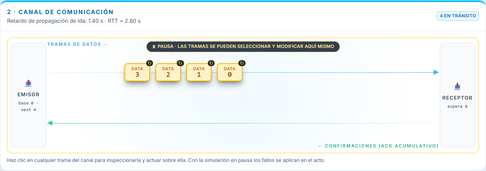
**Figura 17.** Las cuatro tramas de la ventana viajando de nuevo tras el timeout, marcadas con
↻.

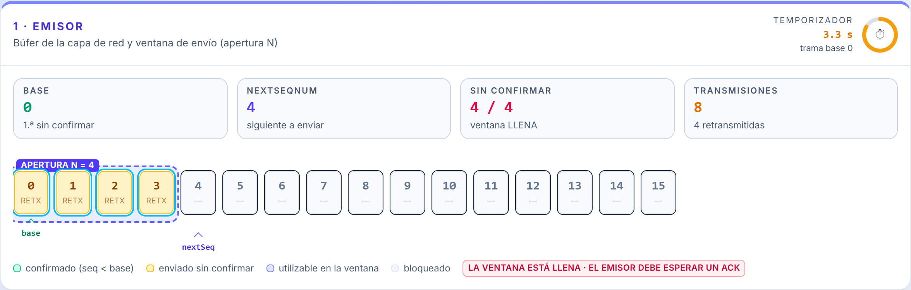
**Figura 18.** El emisor durante la retransmisión: `base` sigue en 0 y las cuatro casillas
están marcadas como `retx`.

**Preguntas.** ¿Cuántas transmisiones se han gastado para entregar cuatro tramas? Compara la
eficiencia de la cabecera antes y después del episodio. ¿Cómo cambiaría el resultado con
repetición selectiva?

## Práctica 4 — Timeout prematuro

**Objetivo.** Entender por qué `T_out` debe superar al RTT.

1. Reinicia. Baja el temporizador a 2,00 s dejando `t_p = 1,4 s` (RTT = 2,8 s).
2. Observa el aviso en rojo bajo el slider.
3. Envía una trama y no toques nada más.

**Observa.** El temporizador expira **antes** de que pueda llegar el ACK. El emisor retransmite
una trama que estaba llegando perfectamente; el receptor la descarta por duplicada y reenvía el
mismo ACK.

**Preguntas.** ¿Qué valor mínimo debería tener `T_out`? ¿Qué ocurre si además hay tiempo de
proceso en el receptor?

## Práctica 5 — Del simulador al enlace real

**Objetivo.** Conectar la simulación con los números de un enlace de verdad.

1. Abre la pestaña «Calculadora» y pulsa «Cargar el ejemplo del satélite de Tanenbaum».
2. Anota `t_f`, `a`, la eficiencia con parada y espera y la ventana necesaria.
3. Sube `N` de 1 a 26 y observa cómo crece la utilización.
4. Sube `P` al 10 % y mira la BER equivalente y la caída de utilización.

**Preguntas.** ¿Por qué con `N = 26` y `P = 10 %` la utilización no llega al 90 %? ¿Qué le
ocurre a la eficiencia de Go-Back-N cuando `N` crece y `P` es alta, y por qué?

---

# 9. Atajos de teclado

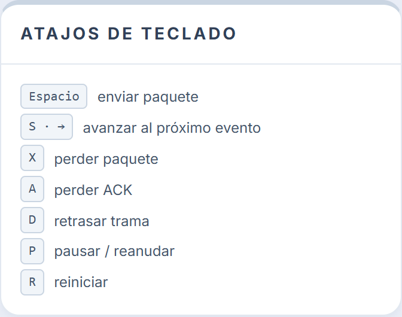
**Figura 19.** Atajos disponibles.

| Tecla | Acción |
| --- | --- |
| `Espacio` o `Enter` | Enviar nuevo paquete |
| `S` o `→` | Avanzar al próximo evento |
| `X` | Provocar pérdida de trama de datos |
| `A` | Provocar pérdida de ACK |
| `D` | Provocar retraso |
| `P` | Pausar / reanudar |
| `R` | Reiniciar |

Los atajos se desactivan mientras el foco está en un control de formulario.

---

# 10. Resolución de problemas

| Síntoma | Causa probable | Solución |
| --- | --- | --- |
| El botón «Enviar nuevo paquete» está en gris | La ventana está llena o ya se enviaron los 16 paquetes | Lee el mensaje bajo el botón: indica siempre el motivo. Espera un ACK o reinicia con `R` |
| No se mueve nada en el canal | La simulación está en pausa | Pulsa «▶ Reanudar» o la tecla `P`. La cabecera muestra «⏸ en pausa» |
| Pulso «Provocar pérdida» y no ocurre nada | No hay ninguna trama de ese tipo viajando | El fallo queda **armado**: aparece una etiqueta en la cabecera del canal y se aplicará a la siguiente trama |
| Se producen timeouts sin que yo pierda nada | `T_out` es menor que el RTT | Sube el temporizador por encima de `2 · t_p`, o baja el retardo de propagación |
| Hay dos tramas superpuestas en el canal | Salieron casi a la vez | El simulador las separa en vertical automáticamente; pulsa una para identificarla en la ficha |
| La animación se detiene al cambiar de pestaña del navegador | El navegador suspende las animaciones de las pestañas en segundo plano | Es el comportamiento normal. El reloj de simulación se reanuda al volver, sin saltos |
| `npm run dev` falla con «port 5173 is in use» | Ya hay un servidor de desarrollo abierto | Ciérralo con `Ctrl + C` en su terminal, o abre la dirección que Vite proponga |
| `npm install` falla | Versión de Node.js antigua | Instala Node.js 20.19 o superior y repite |
| El texto se ve apretado o con barras de desplazamiento | Ventana estrecha | La aplicación necesita 1280 px de ancho como mínimo; el búfer de 16 casillas se desplaza en horizontal si no cabe |

---

# 11. Glosario

**ACK (*acknowledgement*).** Trama de confirmación que el receptor envía al emisor.

**ACK acumulativo.** Confirmación que reconoce todas las tramas hasta el número indicado
inclusive, y no solo esa.

**Apertura de la ventana (`N`).** Número máximo de tramas que el emisor puede tener enviadas y
sin confirmar simultáneamente.

**`base`.** Número de secuencia de la primera trama enviada y todavía sin confirmar.

**BER (*bit error rate*).** Probabilidad de que un bit concreto llegue alterado.

**Encauzamiento (*pipelining*).** Técnica que permite tener varias tramas en vuelo a la vez.

**`expectedSeqNum`.** Número de secuencia de la única trama que el receptor está dispuesto a
aceptar.

**Producto ancho de banda–retardo.** Bits que caben simultáneamente dentro del enlace,
`BD = B × RTT`.

**Retardo de propagación (`t_p`).** Tiempo que tarda un bit en recorrer el medio de un extremo
al otro.

**Retroceso N (*Go-Back-N*).** Estrategia por la que, ante un timeout, el emisor retransmite
todas las tramas no confirmadas y no solo la perdida.

**RTT (*round-trip time*).** Tiempo de ida y vuelta, `2 · t_p` en este simulador.

**Tiempo de transmisión (`t_f`).** Tiempo que tarda el emisor en poner una trama completa en el
medio, `t_f = L / B`.

**Timeout prematuro.** Expiración del temporizador antes de que hubiera podido llegar el ACK,
por haber fijado `T_out` por debajo del RTT.

**Velocidad de transmisión (`B`).** Bits por segundo que el emisor inyecta en el medio;
capacidad del enlace.

**Ventana deslizante.** Conjunto de números de secuencia que el emisor puede usar en cada
momento, y que avanza a medida que llegan las confirmaciones.

---

# 12. Bibliografía

1. Tanenbaum, A. S. y Wetherall, D. J. (2012). *Redes de Computadoras* (5.ª ed.). Pearson.
   §3.4 «Protocolos de ventana deslizante»; §3.4.2 «Protocolo de ventana deslizante con
   retroceso N».
2. Stallings, W. (2004). *Comunicaciones y Redes de Computadores* (7.ª ed.). Pearson.
   §7.4 «Rendimiento de ARQ».
3. Kurose, J. F. y Ross, K. W. *Redes de Computadoras: un enfoque descendente*. §3.4.3
   «Retroceso N (GBN)»: autómatas del emisor y del receptor.
4. IEEE Std 1063-2001, *IEEE Standard for Software User Documentation*. (Estructura de este
   manual.)
